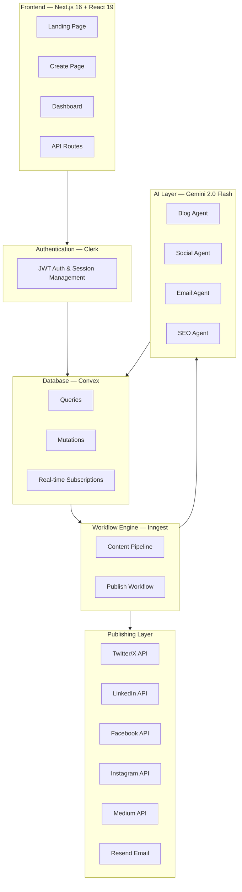
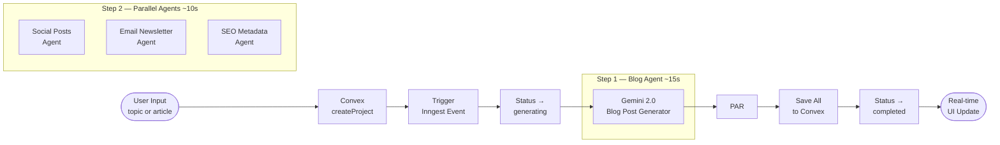
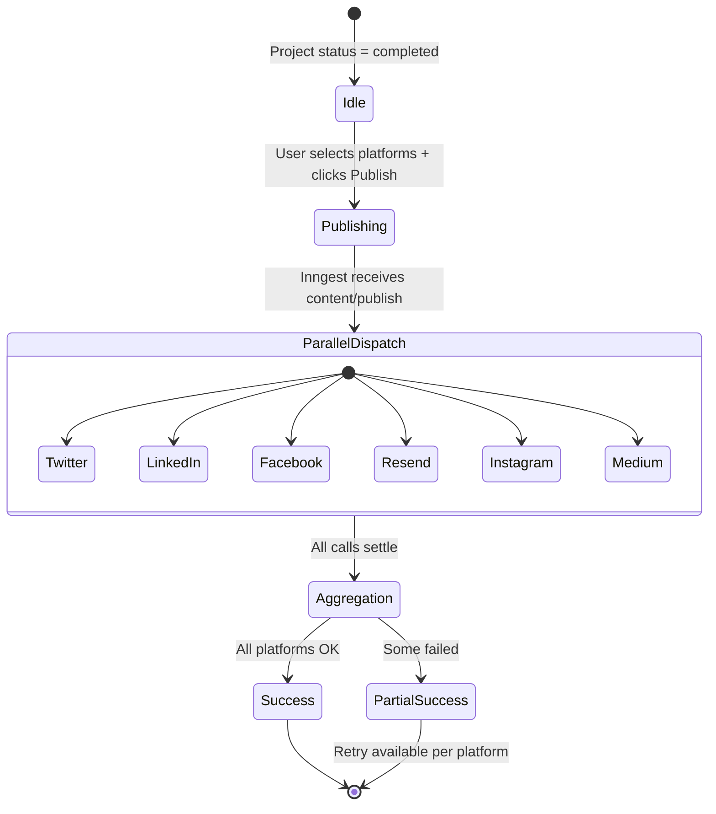
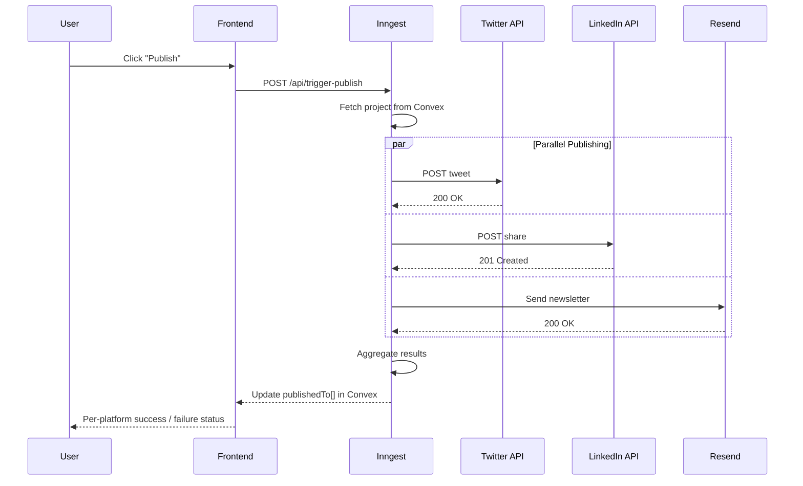
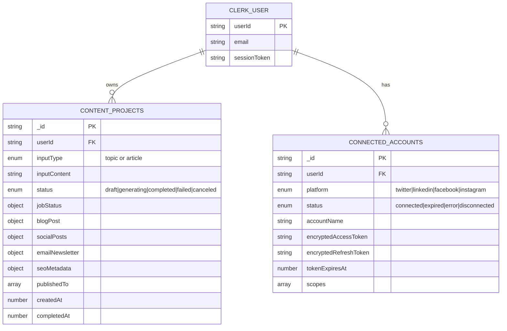
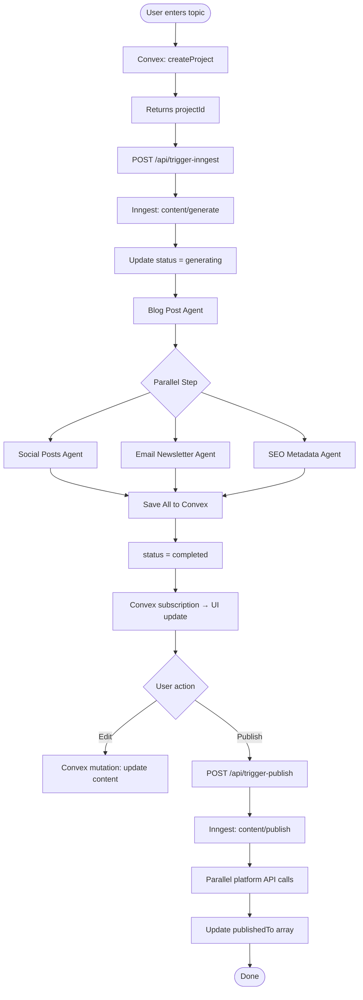
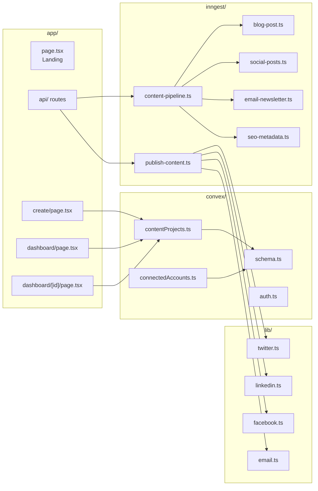

<div align="center">

# InkHive

### AI-Powered Content Marketing Platform

*Transform a single topic into a complete, cross-channel marketing campaign — in parallel.*

[](https://ink-hive-pearl.vercel.app)
[](https://github.com/Abhiraj35/InkHive)
[](https://nextjs.org)

</div>

---

## Table of Contents

- [Overview](#-overview)
- [Why InkHive?](#-why-inkhive)
- [Performance](#-performance)
- [Features](#-features)
- [System Architecture](#-system-architecture)
- [Content Pipeline](#-content-pipeline)
- [Parallel Execution Model](#-parallel-execution-model)
- [Publish Workflow](#-publish-workflow)
- [Database Schema](#-database-schema)
- [Data Flow](#-data-flow)
- [Tech Stack](#-tech-stack)
- [API Reference](#-api-reference)
- [Project Structure](#-project-structure)
- [Security Model](#-security-model)
- [Roadmap](#-roadmap)
- [Getting Started](#-getting-started)

---

## 📌 Overview

InkHive is an **AI-powered content marketing platform** that converts a single topic or article into a complete cross-channel marketing campaign — blog posts, social media content, email newsletters, and SEO metadata — all generated in parallel and ready to publish.

> Built with **Next.js 16**, **Convex**, **Inngest**, and **Google Gemini 2.0 Flash**.

---

## 💡 Why InkHive?

Marketing teams repeat the same bottleneck every time: adapt one idea into content for every channel. Writing a blog post, then reformatting it for Twitter, LinkedIn, Facebook, Instagram, Medium, and email takes hours.

**InkHive automates the entire pipeline:**

| Without InkHive | With InkHive |
|---|---|
| Write blog manually (~45 min) | Enter one topic |
| Adapt for each social platform (~30 min) | Four AI agents run in parallel |
| Draft email newsletter (~20 min) | Done in ~25 seconds |
| Optimize SEO metadata (~15 min) | One-click publish to all channels |
| **~2 hours total** | **~25 seconds + review** |

---

## ⚡ Performance

| Metric | Value |
|---|---|
| Total generation time | ~25 seconds |
| Sequential equivalent | ~55 seconds |
| Speed improvement | **2.4× faster** |
| Content creation time saved | **~80%** |
| Platforms supported | 6 (Twitter, LinkedIn, Facebook, Instagram, Medium, Email) |

---

## ✨ Features

| Feature | Description | Status |
|---|---|---|
| **AI Content Generation** | 4 specialized agents: blog, social, email, SEO — from one input | ✅ Stable |
| **Parallel Execution** | All agents run simultaneously via Inngest durable functions | ✅ Stable |
| **Multi-Platform Publish** | One-click publish to Twitter/X, LinkedIn, Facebook, Instagram, Medium, Email | 🔶 Beta  |
| **Real-Time UI Updates** | Live agent progress via Convex subscriptions — zero polling | ✅ Stable |
| **Research Mode** | Optional pre-generation AI research for trending angles | 🔶 Beta |
| **In-Browser Editing** | Full edit of all generated content before publishing | ✅ Stable |
| **Generation Cancel** | Cancel mid-process to save AI tokens | ✅ Stable |
| **JWT Authentication** | Clerk-backed auth with server-side identity verification | ✅ Stable |

---

## 🏗 System Architecture



---

## 🔄 Content Pipeline



### How the Pipeline Works

| Step | Agent | Output | Duration |
|---|---|---|---|
| **1** | Blog Post Agent | Title, 1000+ word markdown post, excerpt, reading time | ~15s |
| **2a** | Social Posts Agent | Twitter (280ch), LinkedIn (600ch), Facebook, Instagram, Medium | ~10s (parallel) |
| **2b** | Email Newsletter Agent | 3 subject lines, preview text, HTML body, plain text | ~10s (parallel) |
| **2c** | SEO Metadata Agent | Title (<60ch), description (150-160ch), keywords[], URL slug | ~10s (parallel) |

> **Why Blog runs first:** The full blog post is injected as context into the three parallel agents, ensuring social posts, email, and SEO are semantically grounded in the complete article — not just the raw topic.


## 🚀 Publish Workflow





---

## 🗄 Database Schema



### `contentProjects` — Full Field Reference

```ts
{
  // Identity
  _id:             string           // auto-generated
  userId:          string           // Clerk user ID

  // Input
  inputType:       "topic" | "article"
  inputContent:    string           // raw user input

  // Status
  status:          "draft" | "generating" | "completed" | "failed" | "canceled"
  jobStatus: {
    research:        "pending" | "running" | "completed" | "failed"
    blogPost:        "pending" | "running" | "completed" | "failed"
    socialPosts:     "pending" | "running" | "completed" | "failed"
    emailNewsletter: "pending" | "running" | "completed" | "failed"
    seoMetadata:     "pending" | "running" | "completed" | "failed"
  }

  // Generated Content
  blogPost: {
    title:        string    // compelling, SEO-friendly
    content:      string    // 1000+ words, markdown with H2 headings
    excerpt:      string    // 150 chars
    readingTime:  number    // minutes
    isEdited:     boolean
  }

  socialPosts: {
    twitter:   { text: string, imageUrl?: string, status, publishedAt? }
    linkedin:  { text: string, imageUrl?: string, status, publishedAt? }
    facebook:  { text: string, imageUrl?: string, status, publishedAt? }
    instagram: { text: string, imageUrl?: string, status, publishedAt? }
    medium:    { text: string, imageUrl?: string, status, publishedAt? }
    isEdited:  boolean
  }

  emailNewsletter: {
    subjectLines:        string[]   // 3 variants
    previewText:         string
    htmlContent:         string
    plainText:           string
    selectedSubjectLine: number     // index into subjectLines
    isEdited:            boolean
  }

  seoMetadata: {
    title:       string    // <60 chars
    description: string    // 150-160 chars
    keywords:    string[]
    slug:        string    // URL-safe
    isEdited:    boolean
  }

  // Publishing
  publishedTo:     string[]   // ["twitter", "linkedin", "email"]
  lastPublishedAt: number

  // Timestamps
  createdAt:   number
  updatedAt:   number
  completedAt: number
}
```

### `connectedAccounts` — OAuth Connections

```ts
{
  _id:                    string
  userId:                 string   // Clerk user ID
  platform:               "twitter" | "linkedin" | "facebook" | "instagram"
  status:                 "connected" | "expired" | "error" | "disconnected"
  accountName:            string   // e.g. "@mybrand"
  accountId:              string
  encryptedAccessToken:   string   // AES-encrypted
  encryptedRefreshToken:  string   // AES-encrypted
  tokenExpiresAt:         number
  scopes:                 string[]
  createdAt:              number
  updatedAt:              number
}
```

### Indexes

| Index Name | Fields | Use Case |
|---|---|---|
| `by_user` | `userId` | Fetch all projects for a user |
| `by_status` | `status` | Filter by generation state |
| `by_user_and_status` | `userId + status` | Dashboard filtering |
| `by_public_slug` | `slug` | Public blog URL lookup |

---

## 🌊 Data Flow



---

## 🛠 Tech Stack

| Layer | Technology | Purpose |
|---|---|---|
| **Frontend** | Next.js 16, React 19, TypeScript | App Router, SSR, type safety |
| **Styling** | Tailwind CSS v4, shadcn/ui, Base UI | Responsive component system |
| **State** | Convex React (`useQuery`, `useMutation`) | Real-time reactive state |
| **Auth** | Clerk | JWT sessions, OAuth, server-side identity |
| **Database** | Convex | Serverless real-time DB with compound indexes |
| **Workflows** | Inngest | Durable execution, retries, cancellation |
| **AI Model** | Google Gemini 2.0 Flash | Structured content generation |
| **Email** | Resend | Newsletter delivery (HTML + plain-text) |
| **Publishing** | Twitter, LinkedIn, Facebook, Instagram, Medium APIs | Cross-platform distribution |

---

## 📡 API Reference

### Convex API

#### Queries

```ts
// Fetch all projects for the authenticated user
api.contentProjects.getUserProjects()

// Fetch a single project by ID (no auth check)
api.contentProjects.getProjectById({ projectId })

// Fetch project with authorization enforcement
api.contentProjects.getProject({ projectId })
```

#### Mutations

```ts
// Create a new content project
api.contentProjects.createProject({
  inputType: "topic" | "article",
  inputContent: string,
})

// Update project status
api.contentProjects.updateProjectStatus({ projectId, status })

// Save AI-generated content
api.contentProjects.saveBlogPost({ projectId, title, content, excerpt, readingTime })
api.contentProjects.saveSocialPosts({ projectId, twitter, linkedin, facebook, instagram, medium })
api.contentProjects.saveEmailNewsletter({ projectId, subjectLines, previewText, htmlContent, plainText })
api.contentProjects.saveSeoMetadata({ projectId, title, description, keywords, slug })

// Save user edits
api.contentProjects.updateBlogPost({ projectId, content })
api.contentProjects.updateSocialPost({ projectId, platform, text })
api.contentProjects.updateEmailNewsletter({ projectId, ...fields })
api.contentProjects.updateSeoMetadata({ projectId, ...fields })

// Cancel a running generation job
api.contentProjects.cancelProject({ projectId })
```

### HTTP Routes

| Endpoint | Method | Description |
|---|---|---|
| `/api/trigger-inngest` | `POST` | Start content generation pipeline |
| `/api/trigger-publish` | `POST` | Dispatch publish workflow |
| `/api/cancel-generation` | `POST` | Cancel running generation job |
| `/api/upload` | `POST` | Upload image or media asset |
| `/api/integrations/*` | `GET` | OAuth callback handlers |

### Inngest Events

| Event | Payload | Description |
|---|---|---|
| `content/generate` | `{ projectId, inputType, inputContent }` | Trigger full AI generation pipeline |
| `content/publish` | `{ projectId, platforms[] }` | Publish to selected platforms in parallel |
| `content/cancel` | `{ projectId }` | Gracefully cancel a running pipeline |

---

## 📁 Project Structure



```
ai-content-marketing/
├── app/
│   ├── page.tsx                        # Landing page
│   ├── create/page.tsx                 # Content creation page
│   ├── dashboard/
│   │   ├── page.tsx                    # Project list
│   │   └── [projectId]/page.tsx        # Project editor
│   └── api/
│       ├── trigger-inngest/            # Start generation
│       ├── trigger-publish/            # Start publishing
│       ├── cancel-generation/          # Cancel pipeline
│       ├── upload/                     # Media uploads
│       └── integrations/              # OAuth callbacks
│
├── convex/
│   ├── schema.ts                       # Database schema
│   ├── contentProjects.ts             # Queries & mutations
│   ├── connectedAccounts.ts           # Platform OAuth data
│   └── auth.ts                        # Clerk integration
│
├── inngest/
│   ├── client.ts
│   └── functions/
│       ├── content-pipeline.ts        # Main generation workflow
│       ├── publish-content.ts         # Publishing workflow
│       └── steps/ai-generation/
│           ├── blog-post.ts
│           ├── social-posts.ts
│           ├── email-newsletter.ts
│           └── seo-metadata.ts
│
├── lib/
│   ├── publish/
│   │   ├── twitter.ts
│   │   ├── linkedin.ts
│   │   ├── facebook.ts
│   │   ├── instagram.ts
│   │   ├── medium.ts
│   │   └── email.ts
│   └── integrations/
│       ├── platforms.ts
│       ├── oauth.ts
│       └── crypto.ts
│
└── components/
    ├── ui/                            # shadcn/ui components
    └── blocks/                        # Section-level components
```

---

## 🔒 Security Model

| Concern | Implementation |
|---|---|
| **Authentication** | Clerk JWT — all Convex mutations call `ctx.auth.getUserIdentity()` server-side. Client-supplied `userId` is never trusted. |
| **Authorization** | Project ownership is enforced at the mutation level. Users can only read/write their own projects. |
| **OAuth Token Storage** | Platform tokens are AES-encrypted before storage in Convex. Never exposed to the frontend. |
| **API Key Management** | Google AI, Resend, and social credentials are environment variables — zero client-side exposure. |
| **Input Validation** | All Convex mutations use Zod schemas. Invalid payloads are rejected before touching the database. |

---

## 🗺 Roadmap

| Feature | Description | Priority |
|---|---|---|
| **Brand Voice Training** | Train AI on your existing content to replicate brand writing style | 🔴 High |
| **Custom Templates** | Save, name, and reuse content generation templates | 🔴 High |
| **Analytics Dashboard** | Track post engagement metrics across all platforms | 🟡 Medium |
| **Content Calendar** | Visual scheduling interface for future publishing | 🟡 Medium |
| **A/B Testing** | Test subject line and copy variants with engagement tracking | 🟡 Medium |
| **Team Collaboration** | Multi-user workspaces with role-based access control | 🟢 Low |
| **AI Research Mode** | Perplexity API integration for real-time trend sourcing | 🟢 Low |
| **Multi-Language Support** | Generate content in any language from a single input | 🟢 Low |

---

## 🚀 Getting Started

### Prerequisites

- Node.js 18+
- pnpm
- Accounts: [Convex](https://convex.dev), [Clerk](https://clerk.com), [Google AI Studio](https://aistudio.google.com), [Resend](https://resend.com)

### Installation

```bash
# Clone the repository
git clone https://github.com/Abhiraj35/ai-content-marketing.git
cd ai-content-marketing

# Install dependencies
pnpm install

# Copy environment template
cp .env.example .env.local
```

### Environment Variables

```env
# Convex
NEXT_PUBLIC_CONVEX_URL=your_convex_url

# Clerk Auth
CLERK_PUBLISHABLE_KEY=your_clerk_publishable_key
CLERK_SECRET_KEY=your_clerk_secret_key

# Google Gemini
GOOGLE_API_KEY=your_google_api_key

# Email (Resend)
RESEND_API_KEY=your_resend_api_key

# Social Platform OAuth
TWITTER_CLIENT_ID=your_twitter_client_id
TWITTER_CLIENT_SECRET=your_twitter_client_secret
LINKEDIN_CLIENT_ID=your_linkedin_client_id
LINKEDIN_CLIENT_SECRET=your_linkedin_client_secret
FACEBOOK_CLIENT_ID=your_facebook_client_id
FACEBOOK_CLIENT_SECRET=your_facebook_client_secret
INSTAGRAM_CLIENT_ID=your_instagram_client_id
INSTAGRAM_CLIENT_SECRET=your_instagram_client_secret

# Inngest
INNGEST_API_KEY=your_inngest_api_key
INNGEST_EVENT_KEY=your_inngest_event_key
```

### Run Locally

```bash
# Start Convex backend (keep running in background)
pnpm convex dev &

# Start Next.js dev server
pnpm dev
```

Open [http://localhost:3000](http://localhost:3000).

---

## 📚 Related Documentation

- [Convex Docs](https://convex.dev/docs)
- [Inngest Docs](https://www.inngest.com/docs)
- [Google Generative AI](https://developers.google.com/generative-ai)
- [Clerk Docs](https://docs.clerk.com)
- [Resend Docs](https://resend.com/docs)

---

<div align="center">

Built using Next.js · Convex · Inngest · Gemini · Clerk

**[⭐ Star on GitHub](https://github.com/Abhiraj35/InkHive)** · **[🌐 Live Demo](https://ink-hive-pearl.vercel.app)**

</div>